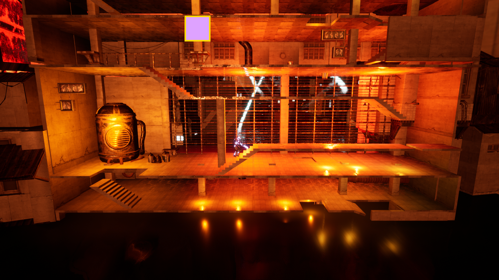

# Welcome to my Portfolio

Hi, my name is Nicolas! I'm currently completing my last semester for my bachelor's degree in computer science with a major in video game design. I see you've stumbled upon my portfolio! Let me take you through my past experiences to give you a feel for the kind of projects I've been working on. Most of these projects will have a Windows-64 build at the provided links.

## School Projects

Considering my current status as a student, it's probably not a surprise to anyone that most of my projects have an educational purpose. As I'm currently completing my sixth and last year of post-secondary education, I'm going to focus mainly on my latest projects.

### Equilibrium

[Equilibrium](https://jgrimard.itch.io/equilibrium) is a serious game centered around depression. The only constraints we had when tasked with making our game was for it to be a serious game. We were then matched with a group of artists that was already split up in teams with their own project ideas. Our team of programmers chose to join a team of artists with the goal of making a game showing the importance of seeking help for people suffering from depression.

|||
|---|---|

My job going in was to implement developper tools such as an in-game debug menu to modify values on the fly, but I also worked on the different menus (Main, Pause, etc.) and have been responsible for implementing the behaviour of the player's companion (Obscure). The game was made using Unreal Engine 4, meaning I had to create task, service and decorator nodes for the companion's behaviour tree. I implemented ways for the game designers to script a movement using splines. I also had to integrate all of the animations because our artists lacked the knowledge required to do it themselves. I implemented a particle-based (particle system made by an FX artist, of course) shockwave effect that is meant to disable the wanderers and make the crossing easier.

|||
|---|---|

### Raven

[Raven](https://github.com/Papa-Victor/8IAR125-ProjetRaven) is a game our AI for games' professor got from a Mat Buckland book he used as a source for his class. It's a top-down shooter featuring AI agents that go around collecting weapons and ammunition and killing each other. The player can view what an agent is thinking by right-clicking them and take control of them by right-clicking them a second time. When controlling the agent, the player can right-click to issue a "go-to" command and left click to issue a "shoot" command. The player can also use the number keys to switch between weapons; this is dependent upon having ammunition for the targeted weapon.

|||
|---|---|

Our assignment was to add a bunch of different behaviours to those agents. The player also had to be able to create teams that would cooperate in different ways (all target the same opponent, warn the others when they die so they can pick up their weapons and ammunitions, etc).

My assignment, along with one of my teammates, was to figure out a way to integrate machine learning into the mix. Our goal was as follows: our agent had to determine every frame if it should fire the weapon in his hands at the currently aimed at location. A more traditional game AI was in charge of aiming towards opponents, choosing what weapon to pull out, etc. My job was to take a bunch of data from the agent's surroundings and determine if firing the weapon was a good option.

To do this, we implemented a way for the player to play the game while being periodically observed by the game. It would record data every time the player fired the weapon and regularly record data of the player not shooting. After a reasonnable amount of time, the player could stop recording and start training. All the player had to do was to let the AI crunch the data as it was training the underlying neural network. After training the neural network, the player could add and remove Machine Learning agents from the map by heading the the ML menu.

|||
|---|---|

## Jam Projects

### Caution Wet Floor

[Caution Wet Floor](https://dragoniko55.itch.io/caution-wet-floor) is a game made during the automn 2019 edition of UQAC's WonderJam. The theme of the event was a climatic catastrophe during the year 2119. Our style constraints were Arcade, Survival and Racing. In this game, the player must race to the top of a procedurally generated building to escape a flood. This game was made using Unreal Engine 4.

For this game, my job was to come up with a way to procedurally generate the building to add to the game's replayability. The way I implemented it allows the level designer to create layers of any width and height and by simply dragging an actor into the level, the metadata would be generated during the BeginPlay event. The only constraint imposed on the level designer was to position said actor at the front bottom-left corner of the layer The metadata would include a map of every hole in the ceiling of a layer. The level designer could then add components telling the actor that the layer under this one should not contain holes in certain areas of its own ceiling. The algorithm would then generate a map of every level that could be spawned on top of every other level.

This way of implenting it meant that our level designer didn't have to worry about keeping track of what level could come after some other level. They could simply design layers as fast as they could and let the game do the rest. In total, our game designer managed to create 5 different layers. That number would've been lower if they had to consider all of those generation-related things.

This all takes place in the initial loading screen, before reaching the main menu. In this loading screen level, an actor will spawn every level, one by one, query the actor for the layer's metadata and store it for later purposes. Then, when the player starts a game, the layers are automatically generated and the game can start.

### OHAINEXI

[OHAINEXI](https://gamejolt.com/games/ohainexi/400308) is a game made during the winter 2019 edition of UQAC's WonderJam. It won second place and was seriously considered for the audacity award but was not chosen due to already being part of the top three games. The theme was pressure and our style constraints were Exploration, Survival and Puzzle. In this game, the player must find their way to the control room of a compromised space station to call for help. They must activate oxygen generators along the way and take care of not opening more rooms than what the currently running generators can provide. This game was made using Unity. The original repository can be found [here](https://github.com/Dragoniko55/WonderJam2019).

|||
|---|---|

For this game, my job was to create a system that would allow us to easily configure oxygen generators and consumers to simulate the actual air pressure in a space station. Each generator is connected to rooms and valves that can propagate the oxygen into more rooms. Opening a valve between two separate pressurised set of rooms would merge them into one set of rooms with the pressure being adjusted to match what we might expect from reality. Closing that valve would separate the sets and adjust the pressure once more.

The most challenging thing during this jam was to create a data structure that would allow us to do all of that without impacting performance. After the first iteration, my algorithm had around six nested for loops traversing all of the oxygen producers and consumers, which resulted in a lag spike every time the network of rooms was altered. In the end, the algorithm ran smoothly and didn't affect performance at all.
